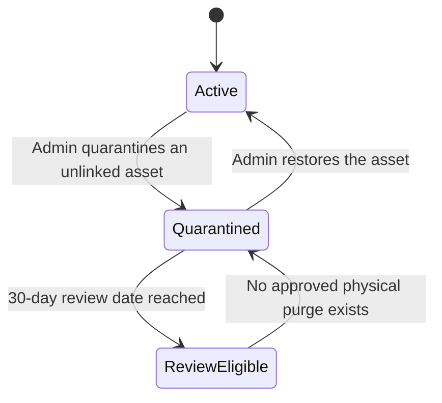
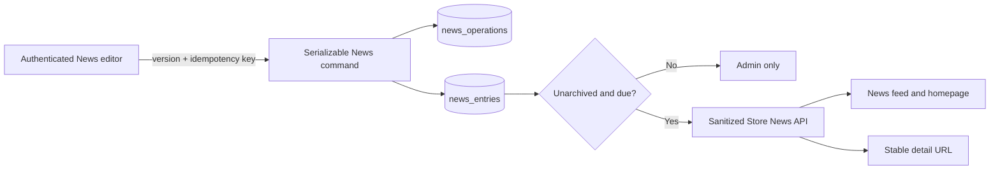

# Remorseless Records backend

This workspace is the Medusa 2 commerce authority. It owns catalog pricing,
inventory, carts, shipping, tax, the official Stripe payment session, orders,
reservations, and notification events. The Next.js storefront is a BFF and UI;
it does not duplicate these rules.

## Local setup

From the repository root, use the pinned pnpm workspace:

```bash
pnpm install
cp backend/.env.template backend/.env
pnpm --filter backend dev
```

For a new local database only, migrate, synchronize module links, and then
seed explicitly:

```bash
pnpm --filter backend exec medusa db:migrate
pnpm --filter backend exec medusa db:sync-links
pnpm --filter backend run seed
```

Do not seed, migrate, or reset a shared Railway database as part of ordinary
process startup.

Required deployed services are PostgreSQL and Redis. MinIO and Meilisearch are
used for media and search. Local fallbacks exist for some modules, but deployed
checkout mutations and jobs require the shared Redis-backed workflow and
locking providers.

## Release and health model

Railway runs `pnpm --filter backend run release:prepare` before switching
traffic. The command fails closed if a migration, module-link sync, read-only
object-storage check, or atomic Meilisearch rebuild fails. Ordinary process
startup only starts Medusa; it never writes secrets to disk, migrates, seeds,
changes bucket policy, or rebuilds search.

- `GET /live` checks only that the process can answer HTTP.
- `GET /ready` checks PostgreSQL, Redis, Meilisearch, and object storage with
  bounded timeouts. It returns `503` when any configured dependency fails.
- `GET /api/health` is a temporary liveness alias for older monitors.

All project-owned Store and Admin abuse controls use a shared Redis
fixed-window counter. One Lua evaluation atomically increments the HMAC-keyed
client bucket and sets its TTL; raw client IPs never enter Redis or logs.
Store, public-form, tax-control, and catalog-media mutations fail closed with a
correlated 503 if Redis cannot make the decision. Catalog, checkout-status,
tax-record, refund, and catalog-media reads retain a bounded 10,000-bucket
process-local fallback for availability. Local development without Redis uses
the same bounded fallback.

The Backend accepts `X-Real-IP` only when Railway provides all of
`RAILWAY_PROJECT_ID`, `RAILWAY_ENVIRONMENT_ID`, and `RAILWAY_SERVICE_ID`.
Outside that boundary it uses the direct socket peer. It never derives rate
identity from `X-Forwarded-For`, vendor headers, or User-Agent. The exact trust
and outage procedures are documented in
[`docs/RELEASE_OPERATIONS.md`](../docs/RELEASE_OPERATIONS.md).

All Backend, Store API, and Admin responses pass through the global security
header boundary. It removes framework disclosure, applies HSTS outside local
development, a default-deny CSP for the same-origin Admin, clickjacking and
MIME protections, a strict referrer policy, and a restrictive Permissions
Policy. Dynamic and mutating responses default to `Cache-Control: no-store`;
versioned `/app/assets/` and `/static/` files retain their framework-managed
cache policy. Configured media URLs are reduced to validated HTTP(S) origins
before entering the Admin image/media allowlist, and production accepts only
HTTPS origins. Local development may still use HTTP services.

Medusa mounts its Admin and some built-in guards outside project API route
middleware. The pinned `@medusajs/framework` patch therefore installs the
configured response-header map in the earliest Express loader, before those
framework-owned routes. Project route middleware repeats the boundary for
custom APIs, while the Admin and static-file servers remain free to replace
the conservative `no-store` default with their reviewed cache policies.

Project API observability middleware validates or creates `X-Request-Id`,
continues valid W3C trace IDs with a new service span, and returns
`traceparent`. Backend completion logs are structured and intentionally omit
paths, queries, headers, bodies, and exception text. Project-owned guard,
checkout, and tax errors use the correlated RFC 7807 contract in
[`docs/API_PROBLEM_CONTRACT.md`](../docs/API_PROBLEM_CONTRACT.md). Native Medusa
errors retain their framework envelope for Admin SDK compatibility.

Framework-owned early responses currently inherit the static security and
cache boundary but bypass project API observability middleware. Dynamic
correlation at that earlier framework seam remains tracked hardening work; do
not describe Admin static responses or built-in pre-router failures as traced.

Public Product visibility follows Medusa's Store boundary: a Product must be
published and linked to at least one sales channel carried by the request's
publishable key. Native Store Product routes enforce that boundary in Medusa.
The shared `src/lib/store-product-visibility.ts` helper applies the same rule to
the custom bundle, shelf, discography, related-product, and product-handle
routes. Their cacheable responses vary on `x-publishable-api-key`; callers must
not reuse a response across keys. The product-handle feed is an opaque,
100-row keyset API rather than an unbounded offset scan.

The Admin build keeps `script-src 'self'` without `unsafe-eval`. A fail-closed
Vite transform disables Zod's empty-`Function` capability probe in direct and
prebundled Dashboard copies, and the post-build package step rejects any Admin
index asset that still contains that probe shape. This preserves normal schema
validation while selecting Zod's CSP-compatible non-JIT parser path.

Production uses Medusa's official `@medusajs/file-s3` provider in
S3-compatible path-style mode. The provider keeps the historical `minio` ID so
existing file records remain valid. The bucket and public-read policy are
provisioned outside application startup.

A deliberate staging write/read/delete canary is available, but never runs
during deploy:

```bash
OBJECT_STORAGE_WRITE_CHECK_CONFIRM=upload-and-delete-canary \
  pnpm --filter backend run storage:verify-write
```

Catalog product images use `POST /admin/catalog/media/uploads`. The
authenticated multipart request includes a UUID idempotency key; the backend
validates image names, media types, signatures, per-file size, and total size
before calling Medusa's File Module. Each successful remote write is
immediately represented by a catalog media asset with its SHA-256 digest and
upload ownership metadata. Exact successful retries return the prior result.
Partial or downstream failures attempt both database and remote cleanup; an
incomplete cleanup is marked failed and retains the owned identifiers for
operator reconciliation instead of being mislabeled as compensated. Abandoning
the editor therefore leaves a visible, auditable unlinked asset instead of an
untracked object.

News images retain the generic `POST /admin/managed-uploads` route. It shares
the same bounded content inspection and additionally accepts validated UTF-8
CSV input for existing import tooling. The unused presigned-upload route is
disabled because it bypasses server-side content inspection.

CSV import is separately authorized from ordinary Product editing. Preparing a
plan through the current plural endpoint requires `product:read`, `file:create`,
and `product_import:create`; confirming it requires `product:read` and
`product_import:update`. The deprecated singular prepare endpoint checks the
same permissions and then returns 410 before multipart parsing; singular
confirm checks `product:read` and `product_import:update` before also returning 410. Legacy plans must be re-prepared through the validated plural workflow.
Approved tooling uses the managed upload followed by the plural prepare/confirm
endpoints. The pinned Dashboard patch removes the unsupported stock import
action and route because that drawer begins with the disabled presigned-upload
route. `pnpm run qa:dashboard-product-import` verifies the source and production
bundles fail closed.

Physical catalog deletion is disabled independently of the Admin UI. Native
DELETE routes for Products, Variants, Collections, Categories, Options, Option
values, Tags, and Types retain their exact native policies and then return a
private, no-store 409 Problem Details response. Custom artist, reference-value,
Product-profile, Variant-profile, and Product-media DELETE handlers return the
same contract. The custom bundle mutation workflow remains available because it
is audited, idempotent, version checked, and compensating. Shelf archive/restore,
media quarantine/restore, and inventory relationship unlinking also remain
available because they are recoverable or do not destroy the underlying catalog
entity. `pnpm run qa:dashboard-product-deletion` verifies that the pinned
Dashboard source and both production bundle formats expose no Product or Variant
delete action.

The Admin **Operations → Media cleanup** route is the safe review surface for catalog assets
that are not linked to any product. Its server-side anti-join returns exact,
paginated active or quarantined results instead of filtering an arbitrary
in-memory slice. Quarantining requires an expected asset version and UUID
idempotency key, runs under the same asset lock used by product-media writes,
and records the actor plus a 30-day review date. Quarantined assets cannot be
linked, edited, or reused, but an operator can restore them at any time.

`media_cleanup:read` grants inspection only. Quarantine and Restore controls
and endpoints additionally require `media_cleanup:update`.

The supporting Admin endpoints are:

- `GET /admin/catalog/media/orphans?lifecycleStatus=active&limit=25&offset=0`
  for an exact unlinked-asset count and deterministic page;
- `POST /admin/catalog/media/assets/:id/quarantine` with
  `{ "expectedVersion": 1, "idempotencyKey": "<uuid>" }`; and
- `POST /admin/catalog/media/assets/:id/restore` with the asset's latest
  version and a new UUID.

Stale versions, linked assets, and conflicting idempotency-key reuse fail
closed. The Admin validates every response, times out stalled requests, and
does not preview arbitrary external URLs in the operator's browser.

There is no `DELETE /admin/catalog/media/assets/:id` method. Physical object
deletion and automatic purge are disabled rather than leaving a dead endpoint
available. The review date is not a deletion schedule; adding a File Module
purge remains separately gated on an operator-approved, fully reconciled
workflow.



Workflow callers under `src/api` use relative imports so production code
resolves the workflow already loaded from `.medusa/server`. ESLint rejects
`@/workflows/**` imports, which would otherwise allow a second source-tree Core
Flows graph to register during packaged startup.

## Admin authorization manifest

`src/lib/admin-authorization-manifest.ts` is the typed authorization inventory
for all 64 active custom Admin methods: 41 under `/admin/catalog/**` and 23
elsewhere. Inventory tests compare route exports to the manifest and fail on a
missing, duplicate, or stale entry. The removed
`/admin/custom` scaffold and the disabled physical media-asset DELETE export do
not remain as unnecessary authenticated route surface.

Each manifest entry declares one or more custom or native Medusa actions. The
generated middleware arrays are conjunctive: every declared action must be
granted. Route templates compile to exact, anchored, case-insensitive matchers
with one non-empty segment per parameter and the router's optional trailing
slash. The manifest generates policy middleware only; rate limits, request
parsers, multipart handling, and terminal compatibility responses remain
separate operational middleware in `src/api/middlewares.ts`.

The catalog capability set is:

- `catalog_authoring` read/create/update/delete for profiles, bundles, managed
  media, and composite Product authoring;
- `catalog_taxonomy` read/create/update/delete for artists and controlled
  reference values; and
- `catalog_merchandising` read/create/update for shelves. Archive is an update
  because it preserves the shelf and its membership for restoration.

Native Product, Product Variant, Price, Inventory Item, Inventory Level, and
File actions are added to the custom action when a handler reads or mutates
those authorities. These 11 catalog definitions bring the code-registered
custom total to 27. The accepted staging state is 260 active policies, one
wildcard, 259 concrete Super Admin permissions, all 27 custom definitions, one
role-policy link, and three unchanged user-role links.

Medusa 2.18 omits update policies from its native single-Product and
single-Variant POST middleware. Project overlays require `product:update` for
generated `prod_...` Product IDs and `product_variant:update` for generated
`variant_...` IDs. Prefix-constrained, exact matchers avoid the static Product
import, batch, and export paths. Pinned route-order tests keep authorization
ahead of native validation and handler execution. These overlays add no policy
definitions and do not change the accepted 260-policy total.

The pinned Medusa 2.18 Variant update handler also verifies the exact
Product/Variant pair before running its workflow, confirms that the workflow
affected a Variant, and rejects a missing parent Product before response
mapping. Missing or mismatched resources therefore return 404 instead of a
false 200 or remapper 500. The preflight is one indexed Variant lookup per
single-Variant update; list, batch, and read paths are unchanged.

Dashboard `handle.permissions` is route metadata, not a fail-closed component
boundary. Catalog routes and widgets still require explicit permission-aware
render boundaries before restricted-role UI behavior is complete. The backend
manifest is authoritative regardless of what the Dashboard renders.

## Checkout payment authority

The only new-payment path is Medusa's official
`@medusajs/payment-stripe` provider (`pp_stripe_stripe`):

- Stripe automatic capture is enabled.
- Automatic payment methods are constrained by
  `STRIPE_PAYMENT_METHOD_CONFIGURATION`.
- The approved configuration contains card, Link, Apple Pay, and Google Pay;
  delayed methods and BNPL are excluded.
- The official signed webhook is
  `POST /hooks/payment/stripe_stripe`.
- The old custom Stripe Checkout Session routes and custom webhook no longer
  exist.

`src/workflows/hooks/validate-checkout-payment.ts` runs inside Medusa's locked
complete-cart snapshot. Positive USD carts require exactly one processable
official Stripe session, and the cart, payment collection, and session amounts
and currencies must match exactly. Zero-total orders require no payment
session.

`POST /store/checkout/status` is an internal recovery endpoint. It requires a
short-lived HMAC proof generated with `CHECKOUT_BFF_SECRET`; browsers never
receive that secret or call the endpoint directly. It returns an order ID only
to the storefront server and only after the cart is durably completed and
linked to the order.

`POST /store/contact` and `POST /store/privacy-request` are also internal
Storefront BFF targets. They require a separate `PUBLIC_FORM_BFF_SECRET` proof
that is bound to the exact serialized body, endpoint purpose, and a 30-second
timestamp window. The routes share a Backend abuse bucket, retain the 16 KiB
body ceiling, and abort Resend delivery after five seconds. Provider and
configuration failures return correlated, neutral problems without copying
email addresses, request bodies, provider diagnostics, or credentials.

## Stripe configuration

Configure all Stripe values together or leave all three empty:

- `STRIPE_API_KEY`
- `STRIPE_WEBHOOK_SECRET`
- `STRIPE_PAYMENT_METHOD_CONFIGURATION`

Refund/dispute lifecycle evidence is an additive integration with a separate
optional secret:

- `STRIPE_LIFECYCLE_WEBHOOK_SECRET`

When configured, Stripe sends the refund/dispute allowlist to
`POST /webhooks/stripe/lifecycle`. The route stores only opaque IDs, status,
amount/currency, timestamps, and retry state—never the raw payload or customer
data. It retrieves current Stripe objects before reconciliation because webhook
delivery can be duplicated or out of order. This endpoint does not issue,
retry, capture, cancel, or synthesize a Medusa refund.

Use `sk_test_...` and a test-mode `pmc_...` outside production. Never log
values. The webhook endpoint must subscribe to:

- `payment_intent.amount_capturable_updated`
- `payment_intent.succeeded`
- `payment_intent.payment_failed`
- `payment_intent.partially_funded`

For local test-mode forwarding:

```bash
stripe listen \
  --forward-to localhost:9000/hooks/payment/stripe_stripe
```

Use the temporary signing secret printed by that process as the local
`STRIPE_WEBHOOK_SECRET`.

Run a second test-mode listener for lifecycle evidence:

```bash
stripe listen \
  --events refund.created,refund.updated,refund.failed,charge.dispute.created,charge.dispute.updated,charge.dispute.closed,charge.dispute.funds_withdrawn,charge.dispute.funds_reinstated \
  --forward-to localhost:9000/webhooks/stripe/lifecycle
```

Use that process's different signing secret as
`STRIPE_LIFECYCLE_WEBHOOK_SECRET`.

## Checkout reconciliation

The `reconcile-checkout-payments` job is a safety net for a lost browser
completion request/response and delayed payment-state processing. Every two
minutes it can inspect a bounded set of old incomplete carts. It calls Medusa's
official complete-cart workflow only when a fresh read shows:

- exactly one processable official Stripe session;
- that session is `authorized` or `captured`;
- the cart is older than the grace period and not completed;
- no order is already linked.

It never creates, confirms, captures, cancels, or refunds a Stripe payment
directly. Immediately before complete-cart, it rechecks the order link and
payment session and durably writes a non-PII attempt marker into cart metadata.
Any prior marker is a fail-closed `heldForReview` result: a stalled or ambiguous
retry cannot blindly repeat completion, and an operator must reconcile Medusa
order/payment/refund state with Stripe before an approved recovery action. It
is disabled by default:

- `CHECKOUT_RECONCILIATION_ENABLED` (default `false`)
- `CHECKOUT_RECONCILIATION_MIN_AGE_SECONDS` (default `120`, range `60–3600`)
- `CHECKOUT_RECONCILIATION_MAX_ATTEMPTS` (default `50`, maximum `250`)
- `CHECKOUT_RECONCILIATION_MAX_SCAN` (default `2000`, range `500–5000`)
- `CHECKOUT_RECONCILIATION_MAX_RUN_SECONDS` (default `90`, range `30–240`)

The job uses a uniquely owned, five-minute application lock in addition to the
scheduled-workflow worker lock. An aggregate warning is emitted for a failed or
held-for-review completion, scan/attempt/time cap, lock-release failure,
scheduler delay, slow run, or large event-loop delay. The structured summary
includes deployment, schedule, duration, event-loop, lock, and aggregate
reconciliation fields but excludes cart, payment, order, email, address,
provider-error, and stack values.
The pinned Medusa Redis workflow patch calculates the scheduled time from
BullMQ's repeat-job `prevMillis`, with enqueue time plus delay as the fallback;
`qa:workflow-scheduler-timestamps` prevents the false scheduler-delay
regression from returning.

## Cart and checkout retention

Two daily, opt-in jobs cover different records.

`remove-expired-anonymous-carts` runs at `04:17 UTC` and removes incomplete
carts with no customer and no email:

- `ANONYMOUS_CART_RETENTION_ENABLED` (default `false`)
- `ANONYMOUS_CART_RETENTION_DAYS` (default/minimum `37`)
- `ANONYMOUS_CART_RETENTION_MAX_DELETIONS` (default `1000`, maximum `10000`)

`remove-abandoned-guest-checkouts` runs at `04:37 UTC` and handles old guest
checkouts containing email/address PII:

- `ABANDONED_CHECKOUT_RETENTION_ENABLED` (default `false`)
- `ABANDONED_CHECKOUT_RETENTION_DAYS` (default/minimum `37`)
- `ABANDONED_CHECKOUT_RETENTION_MAX_DELETIONS` (default `250`, maximum `2500`)

The guest-checkout job re-reads each cart under a lock and protects customer,
completed, recently updated, and order-linked carts. It also protects every
unresolved or successful payment state. It deletes only no-payment carts or
unused sessions in safe `pending`, `canceled`, or `error` states; safe sessions
are removed through Medusa's official payment workflow before cart soft
deletion.

The 37-day minimum preserves the storefront's 30-day cart-cookie lifetime plus
a seven-day grace period. Read-only candidate counts must be reviewed before
either job is enabled in a new environment.

## Tax control and payment evidence

The Tax Module has two installed calculation engines, but exactly one is active
for a new quote:

- TaxRate.io supplies a ZIP-based percentage and its returned monthly
  quota/usage.
- Stripe Tax supplies address-aware, per-line calculations and a calculation
  ID that is bound to the exact Medusa-created PaymentIntent.

Each TaxRate.io lookup is one safe GET operation with at most two attempts
inside the configured deadline. Only transport failures and HTTP 408, 425, or
5xx responses schedule the second attempt; quota rejection and other 4xx
responses never retry. A retry can consume a second metered lookup, so warning
telemetry records only the reason class and attempt count. Provider messages,
statuses, API keys, and postal codes are never copied into terminal errors or
retry logs. Returned total rates must be finite and between 0% and 100%;
malformed, negative, or larger totals fail closed, while invalid optional
breakdown components are discarded.

An authenticated Medusa Admin can review readiness, quota, exact paginated
checkout impact, payment evidence, and an immutable provider-switch history at
**Settings → Tax control**. The current setup is read-only; an explicit provider action
opens the confirmation and audit-reason dialog. Switches increment an internal
generation. Open carts without a prepared payment use the new generation on
their next tax refresh; prepared payments keep their original provider,
generation, fingerprint, and calculation/rate. No cart can combine two
providers.

Native Admin RBAC separates `tax_control:read` from `tax_control:update`.
Read-only operators can inspect readiness and evidence but cannot see or invoke
provider switching or the metered TaxRate.io quota refresh. The backend
enforces the same split before either write handler.

The Admin reads this workspace through the session-authenticated Medusa SDK and
TanStack Query. A complete Zod response contract rejects malformed readiness,
quota, impact, evidence, or history data before it can render. Provider changes
use a Zod-backed TanStack Form inside the confirmation dialog, reuse one
idempotency key for ambiguous retries, and reconcile the returned generation
before reporting an uncertain response as a failure. Client mutations never
retry automatically; the server still rechecks readiness under its distributed
provider lock.

The storefront BFF calls `POST /store/checkout/tax-link` with a short-lived,
purpose-bound `CHECKOUT_BFF_SECRET` proof before returning a client secret and
again before cart completion. The backend verifies the Medusa cart, collection,
session, Stripe PaymentIntent, tax fingerprint, amount, currency, and—when
Stripe Tax is active—the unexpired calculation. One calculation can be attached
to only one PaymentIntent.

Non-PII evidence is reconciled on `order.placed`, `payment.captured`, and
`payment.refunded`, with an hourly bounded safety-net job. It records successful
tax transactions, every individual refund reversal, failed refunds,
Medusa/Stripe refund-ledger mismatches, disputes, and association errors. A
dispute is surfaced for manual tax review because Stripe does not automatically
reverse tax merely because a payment is disputed.

Existing Stripe-taxed order lines retain their historical effective tax rates
during returns and safe order updates. New taxable items on a Stripe-taxed order
fail closed: Medusa may require a separate additional payment, and that payment
needs its own bound Stripe Tax calculation. Until that dedicated flow exists,
create a separate order instead of bypassing tax/payment evidence.

Configuration:

- `TAX_RATE_LOOKUP_API_KEY`
- `TAX_RATE_LOOKUP_MONITOR_POSTAL_CODE` — optional reviewed ZIP for a deliberate
  admin quota refresh; each refresh consumes one real TaxRate.io lookup.
- `TAX_RATE_LOOKUP_CACHE_TTL_MS` — default `300000`.
- `STRIPE_TAX_SHIPPING_TAX_CODE` — required for Stripe Tax readiness.
- `STRIPE_TAX_QUOTE_TTL_MS` — local/Redis quote ceiling, default `1800000`.

Tax and payment-association failures remain checkout failures. The application
does not silently replace a failed final lookup with zero tax. Operational
procedures are in
[`../docs/TAX_CONTROL_OPERATIONS.md`](../docs/TAX_CONTROL_OPERATIONS.md).

## Tax records and filing workpapers

The authenticated Admin **Operations → Tax records** route reads Medusa orders, captured
payments, refunds, delivery destinations, and preserved tax-line evidence into
an auditable period report. It provides New York quarter and March–February
sales-tax-year presets, quality gates, transaction and destination grids, and
signed transaction-detail and destination-summary CSV downloads.

Viewing and exporting use the single `tax_records:read` permission because the
export is a PII-minimized representation of the same report, not a mutation.

The reporting ledger intentionally uses completed commerce records rather than
raw tax-provider calls. Cached lookups may serve many abandoned carts, so an
API-call log cannot establish sales-tax liability. Provider generations and
jurisdiction details remain supporting evidence on the Medusa tax lines.

Legacy tax rows and partial-refund allocations are never presented as
filing-ready: they remain visible with explicit review warnings in the UI and
exports. No customer names, contact details, or street addresses are exported.
The extension does not file or pay a return. See the data contract, filing
workflow, retention rules, and limitations in
[`../docs/TAX_RECORDS_AND_FILING.md`](../docs/TAX_RECORDS_AND_FILING.md).

## Fulfillment location contract

Storefront checkout ships from the canonical `HQ` stock location. Medusa
evaluates inventory and shipping eligibility at the same location, so an
option attached to an empty legacy warehouse is intentionally unavailable even
when aggregate inventory appears positive.

`pnpm run shipping:update` repairs this association without changing any stock
count. It enables the calculated per-item provider at `HQ`, scopes its service
zone to the United States, updates the location's existing shipping option, and
links imported published physical products that are missing Medusa's default
shipping profile.
The storefront follows Medusa's two-step calculated-rate contract: it first
lists eligible options and then calls the provider-backed calculate endpoint
for each calculated option before displaying or selecting it.
Set `SHIPPING_STOCK_LOCATION_NAME` only when an environment intentionally uses
a different canonical location. The command fails instead of guessing when the
location is absent or ambiguous. See
[`src/scripts/README.md`](src/scripts/README.md#shipping-and-inventory-location-repair)
for the exact behavior and verification step.

## Managed product media and discography

The original import left product images on Big Cartel. The migration command
below moves one validated 2,000px maximum master per unique source through
Medusa's configured File Module (MinIO when deployed), deduplicates identical
bytes by SHA-256, and updates native Medusa and custom catalog references only
after every required source is staged.

The command is deliberately polite to Big Cartel: request starts are separated
by at least one second plus jitter, concurrency is bounded at two, requests
time out, `Retry-After` is honored, and retryable failures use exponential
backoff. JPEG, PNG, and WebP signatures, dimensions, declared content type,
byte limit, and checksum are validated before upload. A 2,000px maximum was
selected because the 520px detail gallery can render at 3x density; smaller
runtime sizes are generated by Next Image.

Run the dry inventory, optional two-image probe, confirmed staging, and
confirmed cutover in that order:

```bash
pnpm --filter backend media:big-cartel:migrate
pnpm --filter backend media:big-cartel:migrate -- --probe=2
pnpm --filter backend media:big-cartel:migrate -- \
  --stage \
  --confirm-stage=stage-big-cartel-managed-media
pnpm --filter backend media:big-cartel:migrate -- \
  --apply \
  --confirm-cutover=replace-big-cartel-runtime-media
```

The state file and reports default to
`~/.local/share/remorseless-records/media-migration/`; use `--state-dir` to
choose another protected location. Staging is resumable. `--max-assets=N` is
available for a bounded staging test but is rejected for cutover. Do not remove
Big Cartel from Storefront image/CSP allow-lists until the cutover report has
zero unresolved sources.

Discography has two explicit sources. Every published custom catalog profile
whose controlled product type is `music-release` produces one store-linked
record. Historical releases that are not currently sold are independent manual
records. Store-linked records use the stable Product ID; the customer API
hydrates all referenced Products in one bounded batch and exposes an ID and
handle only while the current Product is published and linked to the requesting
publishable key's sales channel. A missing, unpublished, or out-of-channel
Product therefore leaves a useful discography record without creating a broken
purchase link.

The Storefront cache revalidates this read model every 60 seconds, bounding the
customer-visible lifetime of a recently unpublished or archived link while
avoiding one large Discography fetch per visitor.

The Admin sidebar groups editorial tools beneath **Content**. Discography lives
at `/app/content/discography`, with `/app/discography` retained as a
replace-history compatibility route. Its list is server-paginated, searchable,
filterable, and sortable. Store-linked releases are read-only there because
Products remain their source of truth. Operators can create and edit historical
records, and can archive or restore either source. Hard deletion is disabled.
Each mutation requires an expected version and UUID idempotency key, runs in a
serializable transaction, and records the actor, command hash, and result in
`discography_operations`.

Both Discography list and detail GET methods require `discography:read` and
native `product:read`. Their handlers always return Product enrichment, so the
native grant is a response prerequisite rather than a conditional link-only
capability.

The reconciliation command validates the complete Product projection before a
serializable write. It updates existing linked rows, creates missing rows,
archives linked rows no longer present in the projection, and retains every
manual record. An operator-archived linked record is not silently restored by a
later reconciliation. The final parity check requires exactly one linked row
per projected Product ID and no active stale linked rows:

```bash
pnpm --filter backend discography:build
pnpm --filter backend discography:build -- \
  --apply \
  --confirm-replace=replace-discography-from-catalog
```

The reconciliation plan and completion report default to
`~/.local/share/remorseless-records/discography-rebuild/`. The legacy
`--confirm-replace` flag name remains for command compatibility, but the command
does not delete all records. Reports include created, updated, archived, and
retained-manual counts. Existing discography-only covers are not downloaded by
the product-media migration.

## News publication lifecycle

The News module owns editorial drafts, schedules, publication, stable slugs,
archive state, accessible cover metadata, and its mutation ledger. The Admin
and Storefront never infer visibility independently.

The Admin News workspace lives at `/app/content/news`, with `/app/news`
retained as a replace-history compatibility route. Reads use `GET /admin/news`
with bounded server search, active/archived selection, status filtering, stable
sorting, and offset pagination. The write surface uses:

- `POST /admin/news` to create;
- `PUT /admin/news/:id` to update;
- `POST /admin/news/:id/archive` to hide without deleting; and
- `POST /admin/news/:id/restore` to recover the previous lifecycle state.

Every write requires an expected version and UUID idempotency key. Commands run
in a serializable transaction, reject stale versions, and record the actor,
command, request digest, result, and completion state in `news_operations`.
An exact successful retry replays its stored result; a key reused for another
actor, aggregate, version, command, or payload fails with a conflict.

The Store API is deliberately narrower. `GET /store/news` and
`GET /store/news/:slug` expose only rows where `archived_at` is null,
`published_at` is due, and the stored status is `published` or `scheduled`.
Scheduled rows therefore become visible without a timer-dependent database
update. Their Store DTO status is normalized to `published`; Draft and Archived
never cross this boundary. Stable ID ordering resolves timestamp ties.

Rich HTML is sanitized during serialization for both Admin and Store output.
The Admin uses Lexical for accessible structured authoring and validates every
API response before rendering it. Covers continue through
`POST /admin/managed-uploads`; the browser validates image type/size before the
request, while the upload route performs the authoritative content checks.
Both the upload response and News write contract allow only `http` or `https`
cover URLs. A persisted cover requires descriptive alt text in the Admin, and
the Storefront propagates it into cards, detail imagery, and social metadata.



## Quality commands

```bash
pnpm --filter backend exec eslint --max-warnings=0 .
pnpm --filter backend exec tsc --noEmit
pnpm --filter backend test
pnpm --filter backend build
```

Operational diagnosis, rollback, webhook rotation, and incident procedures are
documented in [`../docs/CHECKOUT_OPERATIONS.md`](../docs/CHECKOUT_OPERATIONS.md).
