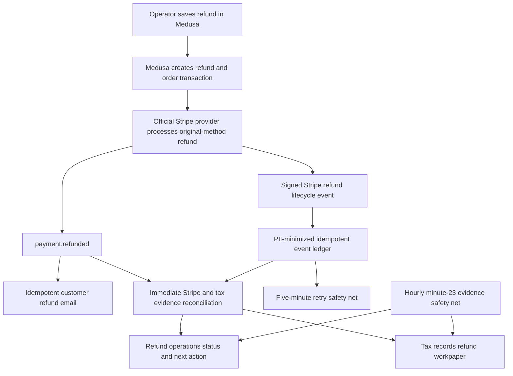

# Refund operations and customer-resolution runbook

Medusa is the only system allowed to issue a customer refund. Stripe processes
that command, and the tax providers supply evidence, but neither the Stripe
Dashboard nor the **Operations → Refunds** Admin extension is a second refund
authority.

This boundary prevents the most dangerous failure in refund operations: paying
the customer twice because Stripe and the Medusa order ledger disagree.

## What the Admin extension does

**Operations → Refunds** has two jobs:

1. explain which native order workflow to use before money moves; and
2. monitor every known refund until Medusa, Stripe, and the applicable tax
   evidence agree.

It deliberately has no **Refund now** button. The operator opens the order and
uses Medusa's existing cancel, return, claim, and payment actions. The extension
is an operational guide and exception queue, not a parallel mutation API.

The role needs `refund_operations:read` to open the reconciliation workspace.
That grant does not grant native Order or Refund reason access. Order links are
shown only with native `order:read`, and the reason-management link only with
native `refund_reason:read`; Medusa remains authoritative for both resources.

The extension reads:

- refunded Medusa orders updated during the last 180 days;
- all tracked tax/payment evidence with a refund, failure, or dispute signal;
- every refund attached to each affected Medusa payment;
- Stripe-observed refund amount, count, and individual statuses;
- Stripe Tax reversal transaction IDs and missing reversal sources; and
- configured Medusa refund-reason count.

The query paginates evidence and refunded orders to a documented 50,000-record
safety limit. A reached limit is shown as an error; a missing row must never be
treated as proof that retrying a refund is safe. Customer names, email
addresses, phone numbers, street addresses, card data, and PaymentIntent client
secrets are not returned to this Admin endpoint.

## Choose the business workflow before the payment action

### 1. Unfulfilled goods

Use the order's cancel flow for the unfulfilled item or order where the policy
allows it. Then inspect the order summary and Payments section for any amount
Medusa still says is owed to the customer.

Do not restock something that was never deducted, and do not issue a standalone
payment refund merely to imitate cancellation.

### 2. Delivered goods are coming back

Create a Medusa return. For damaged, defective, or incorrect goods, use a claim
when that better represents the resolution.

When the package arrives, record the exact received and damaged quantities.
Only saleable received units return to inventory. Complete any refund Medusa
shows in the order's Payments section. This keeps item history, inventory,
order transactions, payment records, and tax reporting connected.

### 3. No inventory is changing

For a shipping refund, pricing correction, or approved goodwill adjustment,
use the payment row's **Refund** action. Enter:

- the exact partial or full amount;
- a configured refund reason; and
- a short customer-facing note that can safely appear in email.

Review the amount before saving. Payment refunds are irreversible.

### 4. Exchange or replacement

Use an exchange or claim so inbound and outbound items are explicit. If the
resulting order summary has a negative outstanding amount, refund that amount
through Payments. If it has a positive outstanding amount, follow the approved
additional-payment workflow; never offset it with an unrelated Stripe action.

## What happens after a Medusa refund

Medusa's refund ID is the customer-email idempotency key. Replayed or duplicate
event delivery therefore does not send a second message for the same refund.
Multiple legitimate partial refunds each receive their own message.

The email states the amount, order number when one exists, the operator's note,
and that the credit returns to the original payment method. It does not promise
a fixed arrival date because the customer's bank controls statement posting.
A checkout-compensation refund can still notify a guest when a cart email
exists even if order creation failed.

Email delivery is useful customer communication, not proof of financial
settlement. Provider and tax verification remain separate.

## Case statuses

| Status              | Meaning                                                                 | Operator behavior                                                                    |
| ------------------- | ----------------------------------------------------------------------- | ------------------------------------------------------------------------------------ |
| **Needs attention** | A failure, dispute, ledger mismatch, tax error, or incomplete audit.    | Stop before another refund; follow the row's next action and reconcile exact totals. |
| **Processing**      | Medusa recorded the refund but Stripe or tax evidence is not yet final. | Do not retry. Allow the next automatic check unless the provider has timed out.      |
| **Verified**        | Medusa, Stripe, and applicable tax evidence agree.                      | No system action. Finish customer communication and policy records.                  |

The tax sub-status is intentionally separate:

- **Reversal verified**: every successful Stripe Tax refund has a committed
  reversal;
- **Reversal pending**: Stripe Tax has not yet exposed every expected reversal;
- **No provider reversal**: TaxRate.io calculated the original rate, while
  Medusa owns the refund/tax filing ledger;
- **Tax not collected**: the original order has explicit disabled-mode
  evidence, so no provider tax transaction or reversal should exist; the
  refund still reduces **Sales pending tax review** in the filing workpaper;
- **Not linked yet**: the Medusa refund exists before payment evidence has been
  observed; and
- **Needs review**: the reversal audit failed, was truncated, or returned an
  association error.

## Exception runbooks

### Stripe reports more refunded than Medusa

This usually means somebody refunded directly in Stripe.

1. Do not issue another refund.
2. Compare every Stripe refund with the Medusa payment and order activity.
3. Preserve the Stripe refund ID, amount, date, status, and operator/audit
   context.
4. Reconcile the Medusa and accounting records through an explicitly approved
   correction procedure.
5. Confirm tax evidence and customer communication independently.

The extension never presents a remaining-refundable shortcut for a mismatched
case. The native Medusa order remains the only place to review or issue money.

### Medusa reports more refunded than Stripe

1. Do not retry while the provider result is pending or ambiguous.
2. Inspect the Stripe refund status and failure reason.
3. Wait for a final state or the next hourly reconciliation.
4. If the refund fails or is canceled, arrange an approved alternative only
   after documenting the failed original attempt.

### Failed or canceled refund

Stop further refunds on the payment. Determine whether the original payment
method can still receive funds. Do not blindly repeat the same command. Record
the approved alternative reimbursement and its relationship to the failed
refund.

### `requires_action` or pending refund

Treat it as in flight. The customer has not necessarily received the money, but
a second refund is unsafe. Escalate only after the provider's documented
processing window or an explicit failure.

### Dispute and refund overlap

A customer can dispute the original charge even after a partial refund.

1. Pause further refunds.
2. Reconcile disputed and refunded amounts.
3. Preserve proof of the refund and customer communication for the dispute.
4. Do not assume a dispute automatically creates or reverses a sales-tax
   transaction.
5. Obtain the store owner's or tax professional's decision for any manual tax
   reversal.

### Stripe Tax reversal is missing

Do not manufacture a tax transaction and do not refund again. Let immediate and
hourly reconciliation retry first. If it remains missing, compare the exact
Stripe refund source with the Tax association and follow the Stripe Tax
incident procedure.

### No order exists

This can happen when payment succeeded but order creation failed and the
checkout workflow compensated the customer.

1. Confirm the payment and refund are the same attempt.
2. Tell the customer not to pay again while recovery is checked.
3. Verify the refund in Stripe and the tax evidence record.
4. Confirm the idempotent refund email was created if the cart had an email.
5. Investigate checkout completion separately; never manufacture an order only
   to make the refund row look normal.

## Edge-case policy matrix

| Scenario                              | Correct handling                                                                                         |
| ------------------------------------- | -------------------------------------------------------------------------------------------------------- |
| Full refund                           | Review captured and already-refunded totals, then refund the remaining exact amount in Medusa.           |
| Multiple partial refunds              | Each has its own Medusa record, Stripe status, tax reversal where applicable, and email idempotency key. |
| Shipping-only refund                  | Payment-only correction; no inventory mutation.                                                          |
| Bundle or mystery product             | Payment semantics are unchanged; return/claim the actual physical units and record their condition.      |
| Merchandise size/format               | Use the purchased variant; never substitute a catalog label for the order line.                          |
| Anonymous checkout                    | Refund the Medusa order normally; notification uses the order email without requiring an account.        |
| Compensated checkout without an order | Monitor as **Checkout recovery** and use the cart email if available.                                    |
| Multiple payments on one order        | Reconcile each payment separately; do not assume one refund applies across providers.                    |
| Tax provider switched after purchase  | Historical evidence stays with the payment's provider/generation; do not recalculate the old order.      |
| Damaged return                        | Record damaged quantity so it is not added back to saleable inventory.                                   |
| Refund reason missing                 | Configure reasons before routine operations; do not replace structured reasons with inconsistent notes.  |
| Customer asks where the credit is     | Confirm provider success, then explain that their bank controls final statement posting.                 |

## Observability and service objectives

The existing `payment.refunded` tax-evidence subscriber performs immediate
reconciliation. The `reconcile-tax-evidence` job runs hourly at minute 23,
oldest eligible evidence first, with a 100-record per-run cap, bounded Stripe
timeouts/retries, and a per-PaymentIntent distributed lock. Current refund,
dispute, PaymentIntent, Tax association, and refund-list GETs share one
eight-second lifecycle/reconciliation deadline. Nested SDK retries are off;
each safe GET can retry once only for an eligible transient failure, and rate
limits stay single-attempt. Strict response validation runs before persistence,
and logs contain fixed operation/reason/attempt metadata rather than Stripe
messages or payloads.

Stripe's separate lifecycle endpoint listens only for `refund.created`,
`refund.updated`, `refund.failed`, and the created/updated/closed/funds
withdrawn/funds reinstated dispute events. It records the event ID plus a
minimal immutable projection and processes only after retrieving current
provider state. Duplicate delivery is idempotent, event order is irrelevant,
and the five-minute retry job recovers queue outages, failed attempts, and
workers left processing for more than 15 minutes.

The refund-notification subscriber logs only opaque payment identity and
notification count; it does not log recipient addresses, notes, card data, or
client secrets.

Operational objectives:

- zero duplicate refunds caused by application/operator workflow;
- 100% of Medusa refund amounts reconciled with Stripe;
- 100% of successful Stripe Tax refunds linked to their expected reversals;
- all failed, canceled, disputed, mismatched, or truncated cases visible in the
  Admin queue;
- retry-safe customer notification per Medusa refund; and
- unresolved provider/tax exceptions visible within the hourly safety window.
- signed refund/dispute receipts acknowledged promptly and unresolved queue or
  worker failures retried within five minutes.

## Required test matrix

Before a production refund feature release:

- strict typecheck, lint, unit/integration tests, and production build pass;
- no-refund, partial, full, and repeated-partial projections pass;
- TaxRate.io and Stripe Tax paths pass independently;
- pending, `requires_action`, failed, canceled, and disputed cases pass;
- direct-Stripe and Medusa-ahead ledger mismatches produce explicit
  do-not-retry guidance;
- each successful Stripe Tax refund requires its own reversal;
- checkout-without-order compensation remains visible;
- duplicate event delivery proves one email per refund ID;
- invalid signatures, duplicate receipts, out-of-order updates, queue failure,
  stale processing, and missing PaymentIntent references fail safely;
- invalid notification amounts fail closed;
- the Admin page is checked with keyboard, reduced motion, desktop Chrome, and
  a real Chrome mobile-device profile; and
- no irreversible sandbox refund is created without explicit approval.

## Official references

- [Medusa order payments and refunds](https://docs.medusajs.com/user-guide/orders/payments)
- [Medusa returns](https://docs.medusajs.com/user-guide/orders/returns)
- [Medusa claims](https://docs.medusajs.com/user-guide/orders/claims)
- [Medusa order transactions](https://docs.medusajs.com/resources/commerce-modules/order/transactions)
- [Medusa payment flow and refund workflow](https://docs.medusajs.com/resources/commerce-modules/payment/payment-flow)
- [Medusa Notification Module](https://docs.medusajs.com/resources/infrastructure-modules/notification/send-notification)
- [Stripe refunds](https://docs.stripe.com/refunds)
- [Stripe Refund object and statuses](https://docs.stripe.com/api/refunds/object)
- [Stripe webhook delivery behavior](https://docs.stripe.com/webhooks)
- [Stripe Tax reports and refunds](https://docs.stripe.com/tax/reports)
- [Shopify order-refund operations](https://help.shopify.com/en/manual/fulfillment/managing-orders/refunding-orders)
