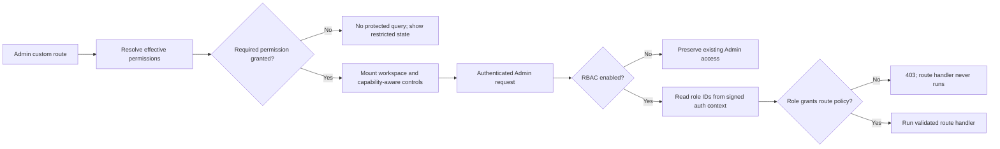

# ADR 0006: Use Medusa native RBAC for custom administration

- Status: accepted; activated on Railway staging
- Date: 2026-08-02
- Activation: 2026-08-08
- Scope: custom Medusa Admin Content and operations routes and APIs

## Context

Medusa authentication already protects every `/admin/*` endpoint, but
authentication alone gives every administrator the same access to custom
Content and operations workspaces. Actor IDs in the custom operation ledgers
answer who changed a record; they do not decide whether that actor was allowed
to read or change it.

Medusa 2.18 includes a feature-flagged native role-based access-control (RBAC)
module, code-registered policies, route policy checks, effective-permission
resolution, and role management in the Admin. Reimplementing those concepts in
custom user metadata would create a second authorization authority and would
not protect Medusa's native resources consistently.

The RBAC bootstrap migration assigns the native `role_super_admin` role to all
existing administrators. That preserves access but the upstream 2.18 script
logs each user's email and ID. Production logs must not become a PII export.

## Decision

- Medusa's RBAC module is the only Admin authorization authority.
- `MEDUSA_FF_RBAC` can be enabled only after the isolated migration, access,
  and rollback rehearsal passes and activation is explicitly approved. That
  gate passed for Railway staging on 2026-08-08.
- Custom policies are registered from `backend/src/policies/content.ts` and
  `backend/src/policies/operations.ts` and are synchronized by Medusa. Routes
  declare policy requirements in the canonical
  `backend/src/api/middlewares.ts` file.
- The backend policy check is authoritative. Admin-side permission checks only
  prevent dead-end controls and protected-data fetches.
- The Admin reuses the Dashboard's native feature-flag and effective-permission
  TanStack Query cache keys. Both responses are runtime-validated before use.
- When RBAC is disabled, the Admin and backend preserve the current authenticated
  administrator behavior. A feature-flag rollback therefore restores the old
  access model without dropping RBAC tables.
- Existing administrators receive the native super-admin role during the first
  enabled migration. The version-pinned `@medusajs/medusa@2.18.0` patch retains
  that behavior but replaces per-user log output with aggregate progress.
- A flag-off release can list the bootstrap script as pending. Medusa evaluates
  the script's feature predicate before inserting its migration-ledger row, so
  a disabled no-op does not consume the later enabled migration.
- The project declares Medusa's RBAC module explicitly from the same strict
  `MEDUSA_FF_RBAC` value. In Medusa 2.18 migration commands, project config is
  evaluated before the framework registers its core feature flags; relying on
  only the default module declaration can therefore log an enabled flag while
  silently leaving the RBAC module disabled.
- Role assignment changes require the affected administrator to sign out and
  sign back in. Route middleware reads role IDs from the signed authentication
  context; an old session must not be treated as evidence of a new role.

## Permission contract

| Resource | Operation | Admin behavior | Protected route behavior |
| --- | --- | --- | --- |
| `news` | `read` | Open News, search, filter, and view active/archived posts | List and detail GET |
| `news` | `create` | Show **Create post** | Collection POST |
| `news` | `update` | Show Edit, Archive, and Restore | Detail PUT and archive/restore POST |
| `news` | `delete` | No hard-delete control is exposed | The hard-disabled DELETE route remains guarded |
| `discography` | `read` | Open Discography and view releases | List and detail GET |
| `discography` | `create` | Show **Add historical release** | Collection POST |
| `discography` | `update` | Show historical Edit, Archive, and Restore | Detail PUT and archive/restore POST |
| `discography` | `delete` | No hard-delete control is exposed | The hard-disabled DELETE route remains guarded |
| native `file` | `create` | Show News cover choose/replace controls | Managed upload POST |
| native `product` | `read` | Show a Discography Product deep link | Native Product authorization remains authoritative |
| `tax_control` | `read` | View provider readiness, usage, audit history, impact, and tax evidence | Tax control GET |
| `tax_control` | `update` | Show provider switch and metered quota-refresh controls | Provider switch and TaxRate.io refresh POST |
| `tax_records` | `read` | View filing workpapers and download minimized CSV exports | Tax records and export GET |
| `refund_operations` | `read` | View refund, Stripe, and tax reconciliation | Refund operations GET |
| native `order` | `read` | Show order deep links in Refund operations | Native Order authorization remains authoritative |
| native `refund_reason` | `read` | Show the Refund reasons deep link | Native Refund reason authorization remains authoritative |
| `media_cleanup` | `read` | View unlinked and quarantined catalog media | Media orphan list GET |
| `media_cleanup` | `update` | Show Quarantine and Restore controls | Quarantine and restore POST |

All required actions in a single route declaration are conjunctive. The
Content landing page is the intentional exception in the UI: it opens when the
actor can read at least one workspace and only renders cards and navigation for
the workspaces that actor can read.

Custom operations routes use one page-level read boundary and separate update
capabilities where they mutate state. A read-only role can inspect Tax control
or Media cleanup without receiving controls that would fail. Refund operations
does not imply native Order access: reconciliation remains readable, while
Order and Refund reason links follow their native grants.



## Controlled activation

Activation is an additive database migration and an environment change. It is
not part of an ordinary code deploy.

1. Take and verify a restorable PostgreSQL snapshot.
2. Record read-only counts for active administrators and any existing RBAC
   roles, policies, and user-role links.
3. Rehearse against an isolated PostgreSQL database with a disposable Admin
   session:

   ```bash
   MEDUSA_FF_RBAC=true pnpm --filter backend exec medusa db:migrate
   MEDUSA_FF_RBAC=true pnpm --filter backend exec medusa db:sync-links
   ```

4. Verify all pre-existing administrators have `role_super_admin`, the
   wildcard policy exists, and the eight custom Content policies were
   synchronized exactly once.
5. Sign in again and verify the effective-permission response includes all
   concrete `news` and `discography` operations rather than wildcard strings.
6. Create disposable viewer/editor roles in the native Admin and test the
   allow/deny matrix for reads, writes, cover upload, Product links, malformed
   paths, and direct API requests. Delete only the disposable users/roles after
   the rehearsal database is discarded.
7. Rehearse rollback by disabling the flag and confirming ordinary
   authenticated Admin access returns without dropping any table.
8. Only after explicit approval, enable `MEDUSA_FF_RBAC=true` in the target
   Railway backend service and deploy through the normal release migration.
9. Require all administrators to sign out and back in, then verify the
   effective permission response and Content smoke matrix before creating any
   restricted production role.

### Isolated rehearsal evidence — 2026-08-02

Steps 1–7 above passed against a disposable PostgreSQL 16.11 clone and Redis,
with staging left unchanged:

- A current pre-RBAC custom-format snapshot was retained outside the repository
  at
  `/home/tylers/.local/share/remorseless-records/backups/2026-08-02-before-rbac/database-before-rbac.dump`.
  It is owned by the local user, mode `0600`, 1,882,161 bytes, with SHA-256
  `3161fd8eea261815baf52133b3ac79be79e24a12898f029e44d58c20d6cabd1a`.
- The first enabled migration exposed the Medusa 2.18 config-order issue above.
  The explicit module declaration fixed it; the next clean restore applied both
  RBAC migrations, synchronized links, and ran the privacy-patched bootstrap.
- Repeating migration and link synchronization was idempotent: 241 policies,
  exactly eight Content policies, one wildcard policy, three original
  Super Admin links for three original administrators, and exactly one
  `create-super-admin-role.js` ledger row.
- A real disposable invite exercised News viewer and Content editor roles.
  Viewer reads succeeded only for News; denied News writes, Discography,
  Product, and managed-upload calls returned 403 before their handlers.
  Malformed paths stayed 404. Editor create, exact replay, update,
  optimistic-conflict, archive, restore, Product-read, and upload-validation
  paths behaved as designed; both hard-delete guards remained effective.
- Role changes proved the documented session contract: an old News-viewer token
  remained unable to create News after the database assignment changed, and a
  fresh login received the editor grants. Medusa's effective-permission endpoint
  reads current role links, so it can reflect the new assignment before an old
  signed session can use it; the server still fails closed until reauthentication.
- Real headed Chromium at 1440×900 and Playwright's built-in Pixel 7 profile,
  both with reduced motion, showed no document overflow or custom pointer
  mismatch. The denied Discography page issued zero protected-data requests.
  Direct screenshots and a real desktop Flameshot capture were inspected.
- On the same migrated database, restarting with `MEDUSA_FF_RBAC=false`
  restored ordinary authenticated News and Discography access, disabled the
  RBAC endpoint with 404, and retained all seven RBAC tables, policies, links,
  and the single bootstrap ledger row.

### Railway staging activation evidence — 2026-08-08

The owner explicitly approved step 8. Activation completed without creating
disposable users, roles, Content, commerce, inventory, payment, or tax records:

- A fresh custom-format snapshot was retained outside the repository at
  `/home/tylers/.local/share/remorseless-records/backups/2026-08-08-before-rbac-activation/database-before-rbac.dump`.
  It is owned by the local user, mode `0600`, 1,887,586 bytes, with SHA-256
  `82e670684f052687f4efc06a055f6099823a59b632ef43da9ab2131b546bf8db`.
  `pg_restore --list` validated the archive before activation.
- The immediate baseline was three active administrators, zero RBAC tables,
  and zero `create-super-admin-role.js` ledger rows.
- Setting `MEDUSA_FF_RBAC=true` created Railway Backend deployment
  `c163ae94-8e4b-4c77-aa43-7f267ca52dfc` at exact revision
  `828f9abc681bf53f320608355922503d97691914`. It reached `SUCCESS`; the build
  explicitly loaded the RBAC flag and produced image
  `sha256:b5899d5aa09a6f4ba7493433fd063d11d2454b66399053c63c280f2b562c8513`.
- The public feature-flag endpoint reports `rbac: true`, and no-store readiness
  returned HTTP 200 with healthy database, Redis, search, and object storage.
- The migrated database has all seven RBAC and user/invite link tables, one
  Super Admin role, 241 policies, eight exact Content policies, one wildcard
  policy, three Super Admin links for three distinct active administrators,
  and exactly one bootstrap ledger row.
- A fresh existing-administrator login returned 200 for authentication and
  `/admin/users/me`; the native effective-permission endpoint returned 240
  concrete permissions and all eight News and Discography grants.
- Real headed Chromium at 1440×900 and Chrome's Pixel 7 device metrics, both
  with reduced motion, loaded Content, News, and Discography without an access
  restriction, document overflow, runtime page error, or HTTP 5xx. News showed
  **Create post**, both Content workspaces were present, direct screenshots
  were inspected, and a real Flameshot capture confirmed the foregrounded
  deployed Admin.

All administrators must still sign out and sign back in after activation or a
later role change so their signed session contains the current role IDs.

### Operations authorization extension — 2026-08-08

Six code-registered policies extend the already active contract without a new
schema migration: Tax control read/update, Tax records read, Refund operations
read, and Media cleanup read/update. Medusa's RBAC module synchronizes them on
application start. Exact API matchers enforce each read or write before its
handler, denied Admin pages do not mount their protected query, and mutation or
native-resource links follow the effective capability set. The Super Admin
role retains access through its existing wildcard policy; restricted roles must
receive only the grants their task requires and then sign in again.

Release acceptance must verify 247 non-deleted policies, one wildcard policy,
246 concrete effective Super Admin permissions, the six exact operations
policies, and unchanged role/user-link counts. A mismatch is a failed release,
not a reason to insert policies or role links manually.

## Rollback

Set `MEDUSA_FF_RBAC=false` and redeploy. Do not drop RBAC tables or remove role
links during the incident; they are additive, retain the intended configuration,
and can be investigated offline. If the migration itself fails, stop the
deployment and restore the verified snapshot rather than editing RBAC rows by
hand.

## Consequences and limitations

The backend now has least-privilege enforcement that composes with Medusa's
native permissions. Read-only roles do not see mutation controls, and denied
custom pages do not start their data query.

Medusa Admin SDK 2.18 does not expose a supported permission predicate in a
custom route's top-level or nested sidebar configuration. A restricted user can
therefore still see **Content** and its **News** or **Discography** child entries
in the surrounding shell, then reach a clear access-restricted page for a
denied workspace. This is a navigation limitation, not an authorization bypass.
A broad Dashboard patch is deliberately avoided; revisit this when the public
Admin extension contract supports permission-aware navigation.

The Medusa bootstrap privacy patch is pinned to exactly 2.18.0. Every Medusa
upgrade must re-audit the upstream migration and either drop or rebase the
patch before changing the pinned version.

Medusa 2.18's effective-permission endpoint resolves current database role
links, while route middleware authorizes from role IDs embedded in the signed
session. During a role change, this can briefly make the Admin aware of a new
grant that the old session cannot exercise. This is fail-closed, and the
operational contract remains an immediate sign-out/sign-in after every role
change. Re-audit this behavior on every Medusa upgrade.

## References

- [Medusa API route middleware](https://docs.medusajs.com/learn/fundamentals/api-routes/middlewares)
- [Medusa protected Admin routes](https://docs.medusajs.com/learn/fundamentals/api-routes/protected-routes)
- [Medusa Admin UI routes](https://docs.medusajs.com/learn/fundamentals/admin/ui-routes)
- [Medusa 2.18 policy registration source](https://github.com/medusajs/medusa/blob/v2.18.0/packages/core/utils/src/modules-sdk/define-policies.ts)
- [Medusa 2.18 route permission source](https://github.com/medusajs/medusa/blob/v2.18.0/packages/core/framework/src/http/middlewares/check-permissions.ts)
- [Medusa 2.18 effective-permission endpoint](https://github.com/medusajs/medusa/blob/v2.18.0/packages/medusa/src/api/admin/rbac/me/permissions/route.ts)
