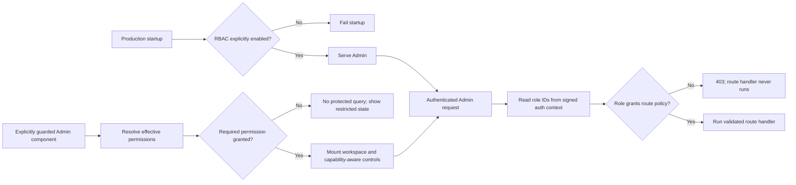

# ADR 0006: Use Medusa native RBAC for custom administration

- Status: accepted; activated on Railway staging
- Date: 2026-08-02
- Activation: 2026-08-08
- Fail-closed hardening: 2026-08-15
- Scope: all custom Medusa Admin APIs, including catalog, Content, operations,
  product import, and managed uploads

## Context

Medusa authentication already protects every `/admin/*` endpoint, but
authentication alone gives every administrator the same access to custom
Content and operations workspaces. Actor IDs in the custom operation ledgers
answer who changed a record; they do not decide whether that actor was allowed
to read or change it.

Medusa 2.18 includes a feature-flagged native role-based access-control (RBAC)
module, code-registered policies, route policy checks, effective-permission
resolution, and role management in the Admin. Reimplementing those concepts in
custom user metadata would create a second authorization authority and would
not protect Medusa's native resources consistently.

The RBAC bootstrap migration assigns the native `role_super_admin` role to all
existing administrators. That preserves access but the upstream 2.18 script
logs each user's email and ID. Production logs must not become a PII export.

## Decision

- Medusa's RBAC module is the only Admin authorization authority.
- `MEDUSA_FF_RBAC` can be enabled only after the isolated migration, access,
  and rollback rehearsal passes and activation is explicitly approved. That
  gate passed for Railway staging on 2026-08-08.
- Custom policies are registered from `backend/src/policies/catalog.ts`,
  `backend/src/policies/content.ts`, `backend/src/policies/operations.ts`, and
  `backend/src/policies/product-import.ts`, then synchronized by Medusa.
- `backend/src/lib/admin-authorization-manifest.ts` classifies every active
  custom Admin method and generates the policy-only middleware entries consumed
  by `backend/src/api/middlewares.ts`. Operational middleware such as rate
  limiting, parsing, uploads, and terminal compatibility responses stays
  separate.
- Route templates compile to exact, anchored, case-insensitive matchers with
  one non-empty path segment per parameter and an optional trailing slash.
- The backend policy check is authoritative. Admin-side permission checks only
  prevent dead-end controls and protected-data fetches when an explicit
  component boundary performs the check; Dashboard `handle.permissions`
  metadata alone is not such a boundary.
- The Admin reuses the Dashboard's native feature-flag and effective-permission
  TanStack Query cache keys. Both responses are runtime-validated before use.
- Production configuration requires RBAC to be explicitly enabled. A missing,
  false, or malformed `MEDUSA_FF_RBAC` value fails startup instead of restoring
  authenticated-only administrator access.
- Flag-off rollback remains available only for local rehearsal. An emergency
  production rollback requires an audited revert to a previously validated
  release; RBAC tables remain additive and recoverable.
- Existing administrators receive the native super-admin role during the first
  enabled migration. The version-pinned `@medusajs/medusa@2.18.0` patch retains
  that behavior but replaces per-user log output with aggregate progress.
- A non-production flag-off rehearsal can list the bootstrap script as pending.
  Medusa evaluates the script's feature predicate before inserting its
  migration-ledger row, so a disabled no-op does not consume the later enabled
  migration.
- The project declares Medusa's RBAC module explicitly from the same strict
  `MEDUSA_FF_RBAC` value. In Medusa 2.18 migration commands, project config is
  evaluated before the framework registers its core feature flags; relying on
  only the default module declaration can therefore log an enabled flag while
  silently leaving the RBAC module disabled.
- Role assignment changes require the affected administrator to sign out and
  sign back in. Route middleware reads role IDs from the signed authentication
  context; an old session must not be treated as evidence of a new role.

## Permission contract

For catalog rows, the **Admin behavior** column names capability intent; it does
not claim that current Dashboard metadata already implements a component-level
guard. Backend route behavior is authoritative.

| Resource | Operation | Admin behavior | Protected route behavior |
| --- | --- | --- | --- |
| `news` | `read` | Open News, search, filter, and view active/archived posts | List and detail GET |
| `news` | `create` | Show **Create post** | Collection POST |
| `news` | `update` | Show Edit, Archive, and Restore | Detail PUT and archive/restore POST |
| `news` | `delete` | No hard-delete control is exposed | The hard-disabled DELETE route remains guarded |
| `discography` | `read` | Open Discography and view releases | List and detail GET, conjunctively with native `product:read` |
| `discography` | `create` | Show **Add historical release** | Collection POST |
| `discography` | `update` | Show historical Edit, Archive, and Restore | Detail PUT and archive/restore POST |
| `discography` | `delete` | No hard-delete control is exposed | The hard-disabled DELETE route remains guarded |
| `catalog_authoring` | `read` | Inspect authoring status, profiles, bundles, and managed media | Catalog authoring GET methods, with route-specific native reads |
| `catalog_authoring` | `create` | Create catalog profiles, bundles, media, or a composite Product | Catalog authoring POST methods, with exact native create/read prerequisites |
| `catalog_authoring` | `update` | Change catalog profiles, bundles, or managed media | Catalog authoring PUT methods, with exact native read/write prerequisites |
| `catalog_authoring` | `delete` | Remove catalog authoring relationships through guarded workflows | Catalog authoring DELETE methods; no physical media-asset deletion |
| `catalog_taxonomy` | `read` | Inspect artists and controlled reference values | Taxonomy GET methods |
| `catalog_taxonomy` | `create` | Create artists and controlled reference values | Taxonomy POST methods and route-specific aggregate prerequisites |
| `catalog_taxonomy` | `update` | Change artists and controlled reference values | Taxonomy PUT methods |
| `catalog_taxonomy` | `delete` | Remove artists and controlled reference values | Taxonomy DELETE methods |
| `catalog_merchandising` | `read` | Inspect shelves and memberships | Shelf GET methods, with native `product:read` when Products are returned |
| `catalog_merchandising` | `create` | Create a shelf and membership set | Shelf POST, conjunctively with native `product:read` |
| `catalog_merchandising` | `update` | Edit, archive, or restore a shelf | Shelf PUT/archive/restore methods; no delete capability |
| native `file` | `create` | Show News cover controls and permit validated CSV upload | Managed upload and import-prepare prerequisites |
| native `product` | `read` | Read Product-backed custom projections and inspect import scope | Discography list/detail, route-specific catalog methods, and every import route |
| native Product/Variant/Price/Inventory resources | route-specific | Permit only the native work an aggregate catalog handler performs | Conjunctive catalog prerequisites for Product, Variant, Price, Inventory Item, and Inventory Level actions |
| `product_import` | `create` | Prepare a reviewable plan from CSV input | Current prepare POST; deprecated prepare rejects after authorization |
| `product_import` | `update` | Confirm and execute an existing plan | Current confirm POST; deprecated confirm rejects after authorization |
| `tax_control` | `read` | View provider readiness, usage, audit history, impact, and tax evidence | Tax control GET |
| `tax_control` | `update` | Show provider switch and metered quota-refresh controls | Provider switch and TaxRate.io refresh POST |
| `tax_records` | `read` | View filing workpapers and download minimized CSV exports | Tax records and export GET |
| `refund_operations` | `read` | View refund, Stripe, and tax reconciliation | Refund operations GET |
| native `order` | `read` | Show order deep links in Refund operations | Native Order authorization remains authoritative |
| native `refund_reason` | `read` | Show the Refund reasons deep link | Native Refund reason authorization remains authoritative |
| `media_cleanup` | `read` | View unlinked and quarantined catalog media | Media orphan list GET |
| `media_cleanup` | `update` | Show Quarantine and Restore controls | Quarantine and restore POST |

All required custom and native actions in a single route declaration are
conjunctive. The Content landing page is the intentional exception in the UI:
it opens when the actor can read at least one workspace and only renders cards
and navigation for the workspaces that actor can read.

The manifest covers exactly 64 active custom Admin methods once: 41 under
`/admin/catalog/**` and 23 elsewhere. Its inventory test derives methods from
the route source and fails on missing,
duplicate, or stale entries rather than trusting a fixed count alone.

Catalog authoring and taxonomy each use complete CRUD capability sets.
Catalog merchandising deliberately has only read/create/update: shelf archive
retains membership and can be restored, so it is an update rather than a hard
delete. The dead `/admin/custom` scaffold and the permanently disabled physical
media-asset DELETE method are removed from the route surface.

Product import uses a dedicated task capability instead of granting arbitrary
manual Product writes. A preparer needs `product:read`, `file:create`, and
`product_import:create`; a confirmer needs `product:read` and
`product_import:update`. The split supports maker/checker roles, while the
wildcard Super Admin policy continues to satisfy both contracts.

Custom operations routes use one page-level read boundary and separate update
capabilities where they mutate state. A read-only role can inspect Tax control
or Media cleanup without receiving controls that would fail. Refund operations
does not imply native Order access: reconciliation remains readable, while
Order and Refund reason links follow their native grants.



The UI branch describes components that implement an explicit permission
boundary. It does not describe catalog route `handle.permissions` metadata:
catalog pages and Product/Variant widgets still need fail-closed component
guards before they may claim the same no-fetch behavior.

## Controlled activation

Activation is an additive database migration and an environment change. It is
not part of an ordinary code deploy.

1. Take and verify a restorable PostgreSQL snapshot.
2. Record read-only counts for active administrators and any existing RBAC
   roles, policies, and user-role links.
3. Rehearse against an isolated PostgreSQL database with a disposable Admin
   session:

   ```bash
   MEDUSA_FF_RBAC=true pnpm --filter backend exec medusa db:migrate
   MEDUSA_FF_RBAC=true pnpm --filter backend exec medusa db:sync-links
   ```

4. Verify all pre-existing administrators have `role_super_admin`, the
   wildcard policy exists, and the eight custom Content policies were
   synchronized exactly once.
5. Sign in again and verify the effective-permission response includes all
   concrete `news` and `discography` operations rather than wildcard strings.
6. Create disposable viewer/editor roles in the native Admin and test the
   allow/deny matrix for reads, writes, cover upload, Product links, malformed
   paths, and direct API requests. Delete only the disposable users/roles after
   the rehearsal database is discarded.
7. Rehearse rollback by disabling the flag and confirming ordinary
   authenticated Admin access returns without dropping any table.
8. Only after explicit approval, enable `MEDUSA_FF_RBAC=true` in the target
   Railway backend service and deploy through the normal release migration.
9. Require all administrators to sign out and back in, then verify the
   effective permission response and Content smoke matrix before creating any
   restricted production role.

### Isolated rehearsal evidence — 2026-08-02

Steps 1–7 above passed against a disposable PostgreSQL 16.11 clone and Redis,
with staging left unchanged:

- A current pre-RBAC custom-format snapshot was retained outside the repository
  at
  `/home/tylers/.local/share/remorseless-records/backups/2026-08-02-before-rbac/database-before-rbac.dump`.
  It is owned by the local user, mode `0600`, 1,882,161 bytes, with SHA-256
  `3161fd8eea261815baf52133b3ac79be79e24a12898f029e44d58c20d6cabd1a`.
- The first enabled migration exposed the Medusa 2.18 config-order issue above.
  The explicit module declaration fixed it; the next clean restore applied both
  RBAC migrations, synchronized links, and ran the privacy-patched bootstrap.
- Repeating migration and link synchronization was idempotent: 241 policies,
  exactly eight Content policies, one wildcard policy, three original
  Super Admin links for three original administrators, and exactly one
  `create-super-admin-role.js` ledger row.
- A real disposable invite exercised News viewer and Content editor roles.
  Viewer reads succeeded only for News; denied News writes, Discography,
  Product, and managed-upload calls returned 403 before their handlers.
  Malformed paths stayed 404. Editor create, exact replay, update,
  optimistic-conflict, archive, restore, Product-read, and upload-validation
  paths behaved as designed; both hard-delete guards remained effective.
- Role changes proved the documented session contract: an old News-viewer token
  remained unable to create News after the database assignment changed, and a
  fresh login received the editor grants. Medusa's effective-permission endpoint
  reads current role links, so it can reflect the new assignment before an old
  signed session can use it; the server still fails closed until reauthentication.
- Real headed Chromium at 1440×900 and Playwright's built-in Pixel 7 profile,
  both with reduced motion, showed no document overflow or custom pointer
  mismatch. The denied Discography page issued zero protected-data requests.
  Direct screenshots and a real desktop Flameshot capture were inspected.
- On the same migrated database, restarting with `MEDUSA_FF_RBAC=false`
  restored ordinary authenticated News and Discography access, disabled the
  RBAC endpoint with 404, and retained all seven RBAC tables, policies, links,
  and the single bootstrap ledger row.

### Railway staging activation evidence — 2026-08-08

The owner explicitly approved step 8. Activation completed without creating
disposable users, roles, Content, commerce, inventory, payment, or tax records:

- A fresh custom-format snapshot was retained outside the repository at
  `/home/tylers/.local/share/remorseless-records/backups/2026-08-08-before-rbac-activation/database-before-rbac.dump`.
  It is owned by the local user, mode `0600`, 1,887,586 bytes, with SHA-256
  `82e670684f052687f4efc06a055f6099823a59b632ef43da9ab2131b546bf8db`.
  `pg_restore --list` validated the archive before activation.
- The immediate baseline was three active administrators, zero RBAC tables,
  and zero `create-super-admin-role.js` ledger rows.
- Setting `MEDUSA_FF_RBAC=true` created Railway Backend deployment
  `c163ae94-8e4b-4c77-aa43-7f267ca52dfc` at exact revision
  `828f9abc681bf53f320608355922503d97691914`. It reached `SUCCESS`; the build
  explicitly loaded the RBAC flag and produced image
  `sha256:b5899d5aa09a6f4ba7493433fd063d11d2454b66399053c63c280f2b562c8513`.
- The public feature-flag endpoint reports `rbac: true`, and no-store readiness
  returned HTTP 200 with healthy database, Redis, search, and object storage.
- The migrated database has all seven RBAC and user/invite link tables, one
  Super Admin role, 241 policies, eight exact Content policies, one wildcard
  policy, three Super Admin links for three distinct active administrators,
  and exactly one bootstrap ledger row.
- A fresh existing-administrator login returned 200 for authentication and
  `/admin/users/me`; the native effective-permission endpoint returned 240
  concrete permissions and all eight News and Discography grants.
- Real headed Chromium at 1440×900 and Chrome's Pixel 7 device metrics, both
  with reduced motion, loaded Content, News, and Discography without an access
  restriction, document overflow, runtime page error, or HTTP 5xx. News showed
  **Create post**, both Content workspaces were present, direct screenshots
  were inspected, and a real Flameshot capture confirmed the foregrounded
  deployed Admin.

All administrators must still sign out and sign back in after activation or a
later role change so their signed session contains the current role IDs.

### Operations authorization extension — 2026-08-08

Six code-registered policies extend the already active contract without a new
schema migration: Tax control read/update, Tax records read, Refund operations
read, and Media cleanup read/update. Medusa's RBAC module synchronizes them on
application start. Exact API matchers enforce each read or write before its
handler, denied Admin pages do not mount their protected query, and mutation or
native-resource links follow the effective capability set. The Super Admin
role retains access through its existing wildcard policy; restricted roles must
receive only the grants their task requires and then sign in again.

That release acceptance verified 247 non-deleted policies, one wildcard policy,
246 concrete effective Super Admin permissions, the six exact operations
policies, and unchanged role/user-link counts.

### Product import authorization extension — 2026-08-15

Two code-registered policies separate upload/plan preparation from plan
execution. Exact method-and-path middleware protects the current plural routes
and Medusa 2.18's still-installed deprecated singular routes:

- `POST /admin/products/imports` requires `product:read`, `file:create`, and
  `product_import:create`;
- deprecated `POST /admin/products/import` checks the same permissions and then
  returns 410 before parsing the multipart body;
- `POST /admin/products/imports/:transaction_id/confirm` requires
  `product:read` and `product_import:update`;
- deprecated `POST /admin/products/import/:transaction_id/confirm` checks the
  same confirmation permissions and then returns 410.

The exact project policy middleware is ordered before Medusa's legacy
multipart parser. Both singular endpoints are retained only as terminal,
no-store problem responses. A legacy plan predates the task-specific policy and
must be re-uploaded and reviewed through the plural workflow rather than being
trusted for execution. A Product reader, file uploader, or Product editor
without the dedicated import grant cannot prepare or confirm an import. Role
changes still require sign-out and sign-in.

Before retiring singular confirmation, a read-only staging aggregate found zero
non-deleted `workflow_execution` rows for the `import-products` and
`import-products-as-chunks` workflow IDs. No transaction ID, workflow context,
administrator, or customer data was selected.

Release acceptance verified 249 non-deleted policies, one wildcard policy, 248
concrete effective Super Admin permissions, eight exact Content policies, six
exact Operations policies, two exact Product Import policies, and unchanged
role/user-link counts.

### Catalog Admin authorization-manifest release acceptance — 2026-08-25

The catalog hardening release introduces a typed, default-deny inventory for
all active custom Admin API methods. The manifest contains exactly 64 unique
method/template pairs: 41 under `/admin/catalog/**` and 23 elsewhere. A source
inventory test fails if a route method lacks an entry, appears more than once,
or leaves a stale manifest entry after removal.

Templates generate policy-only, exact, anchored, case-insensitive matchers with
one non-empty segment for each parameter and an optional trailing slash.
Operational middleware remains separately ordered so rate limiting, request
parsing, multipart handling, and compatibility rejection cannot become an
implicit authorization definition. Every custom and native action listed on a
manifest entry is conjunctive.

Eleven new policy definitions establish `catalog_authoring` CRUD,
`catalog_taxonomy` CRUD, and `catalog_merchandising` read/create/update.
Merchandising has no delete action because shelf removal is a versioned,
recoverable archive. The release also removes the dead `/admin/custom` scaffold
and the permanently disabled physical media-asset DELETE method. Discography
list and detail GETs now require `discography:read` plus native `product:read`
because their responses always load Product enrichment.

The code-registered custom-policy total is now 27. Release acceptance passed on
Railway staging without creating a role, user, link, or application record:

- Root CI `32915688896`, Backend CI `32915688939`, and Storefront CI
  `32915688961` completed successfully for commit
  `797292b66d87e9919c68d9b9e25ebbb5a19982dd`.
- Railway Backend `40fb5e6b-066b-4798-a60f-8b84a4f6b01a` and Storefront
  `7b28678f-81bd-4929-8cf6-052167e5e73e` reached `SUCCESS` on that exact
  source SHA.
- A read-only database transaction verified 260 non-deleted policies, one
  wildcard, 259 concrete policies, and all 27 custom definitions with the exact
  per-resource totals. The database still has one active role, one active
  role-policy link, and three user-role links for three distinct users.
- A fresh existing-administrator login returned 200 for authentication and
  `/admin/users/me`. The native effective-permission endpoint returned 259
  unique concrete permissions, including all 27 custom permission keys, while
  the feature-flag endpoint continued to report `rbac: true`.
- Representative Catalog, Content, Media cleanup, and Tax control reads
  returned 200. An unauthenticated Catalog request returned 401. The removed
  `/admin/custom` route and physical media-asset DELETE method returned 404.
- Backend and Storefront `/live` and `/ready`, plus the Storefront root,
  returned 200. Exact-deployment build and runtime log filters contained no
  warning or error entries.

The restricted-role conjunction matrix remains source-derived and exercises
Medusa's pinned permission resolver without writing disposable staging data.
Operators must not repair a future count mismatch through manual policy or link
inserts.

## Rollback

In production, keep `MEDUSA_FF_RBAC=true` and roll back to the last validated
image. Setting the flag to false is deliberately not a production rollback:
configuration validation will stop the process before it can serve traffic
without authorization enforcement. If incident response explicitly authorizes
restoring the pre-hardening behavior, use an audited code revert and treat the
temporary authenticated-only access as a security exception.

Do not drop RBAC tables or remove role links during the incident; they are
additive, retain the intended configuration, and can be investigated offline.
A flag-off rehearsal remains available in non-production. If an RBAC migration
fails, stop the release before it serves traffic. Restore the verified snapshot
only when the migration failure changed data and cannot be recovered safely;
do not edit RBAC rows by hand.

## Consequences and limitations

The backend now has least-privilege enforcement that composes with Medusa's
native permissions. Explicitly permission-aware Content and operations
components hide mutation controls, and their denied pages do not start a
protected query. Catalog UI components do not yet make that claim.

Medusa Admin SDK 2.18 does not expose a supported permission predicate in a
custom route's top-level or nested sidebar configuration. A restricted user can
therefore still see **Content** and its **News** or **Discography** child entries
in the surrounding shell, then reach a clear access-restricted page for a
denied workspace. This is a navigation limitation, not an authorization bypass.
A broad Dashboard patch is deliberately avoided; revisit this when the public
Admin extension contract supports permission-aware navigation.

The same limitation is more significant for current catalog extensions:
Dashboard 2.18 does not wrap custom routes with its built-in permission guard,
so `handle.permissions` is metadata only and a route or widget can mount
without it being enforced. Catalog pages plus the Product summary and Variant
widgets need explicit fail-closed component boundaries in a separate UI
hardening slice. Backend manifest enforcement already prevents a direct
unauthorized API request from reaching its handler.

The custom manifest does not inventory Medusa's pinned native routes. Medusa
2.18 omits mutation policies from `POST /admin/products/:id` and
`POST /admin/products/:id/variants/:variant_id`, so exact project overlays now
require `product:update` and `product_variant:update`, respectively. The
matchers accept only generated `prod_...` and `variant_...` identifiers; they
cannot collide with Product import, batch, or export paths. Pinned route-sorter
tests prove each overlay runs before native validation and handler execution.
The overlay adds no policy definition or database migration.

Release acceptance passed on Railway staging for
`f411275b63d5aa8ee6f190b9dac318b4e6eef736`:

- Root CI `32918827776`, Backend CI `32918827724`, and Storefront CI
  `32918827742` completed successfully.
- Railway Backend `fb3210d0-e045-40ef-8174-3c5a1ccb35bb` and Storefront
  `401ecb5e-2c05-47a3-85d6-9947f780189c` reached `SUCCESS` on the exact source
  SHA.
- An unauthenticated strict-validation probe returned 401 for each overlaid
  route. The same malformed body returned 400 for the existing Super Admin,
  proving that authentication and authorization passed before native body
  validation without reaching either nonexistent resource.
- The effective-permission endpoint still returned 259 unique concrete
  permissions and all 27 custom keys with RBAC enabled. A read-only database
  transaction confirmed the unchanged 260 active policies, one wildcard, one
  role-policy link, and three Super Admin user links.
- Backend and Storefront `/live` and `/ready`, plus the Storefront root,
  returned 200. Exact-deployment build logs and the final acceptance runtime
  window contained no warning or error entries.

The first non-mutating acceptance attempt sent an empty body to nonexistent
Product and Variant IDs. The Product path returned 404, while the pinned native
Variant handler returned 500 because its response remapper dereferenced the
missing Product. No record could be changed, and the operator-generated stack
is retained in the exact deployment log. A follow-up hardening slice must pin
that behavior and provide a stable 404 while preserving authorization order.

The pinned Dashboard also renders its native Product Import action without the
custom `product_import` permission and first calls the intentionally disabled
presigned-upload route. Backend enforcement remains authoritative. Approved
tooling must use the validated managed-upload endpoint plus the plural
prepare/confirm API until a permission-aware custom import UI is implemented.

The Medusa bootstrap privacy patch is pinned to exactly 2.18.0. Every Medusa
upgrade must re-audit the upstream migration and either drop or rebase the
patch before changing the pinned version.

Medusa 2.18's effective-permission endpoint resolves current database role
links, while route middleware authorizes from role IDs embedded in the signed
session. During a role change, this can briefly make the Admin aware of a new
grant that the old session cannot exercise. This is fail-closed, and the
operational contract remains an immediate sign-out/sign-in after every role
change. Re-audit this behavior on every Medusa upgrade.

## References

- [Medusa API route middleware](https://docs.medusajs.com/learn/fundamentals/api-routes/middlewares)
- [Medusa protected Admin routes](https://docs.medusajs.com/learn/fundamentals/api-routes/protected-routes)
- [Medusa Admin UI routes](https://docs.medusajs.com/learn/fundamentals/admin/ui-routes)
- [Medusa 2.18 policy registration source](https://github.com/medusajs/medusa/blob/v2.18.0/packages/core/utils/src/modules-sdk/define-policies.ts)
- [Medusa 2.18 route permission source](https://github.com/medusajs/medusa/blob/v2.18.0/packages/core/framework/src/http/middlewares/check-permissions.ts)
- [Medusa 2.18 effective-permission endpoint](https://github.com/medusajs/medusa/blob/v2.18.0/packages/medusa/src/api/admin/rbac/me/permissions/route.ts)
