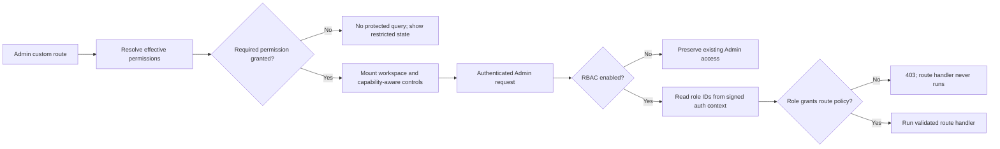

# ADR 0006: Use Medusa native RBAC for custom Content administration

- Status: accepted; production activation pending
- Date: 2026-08-02
- Scope: custom Medusa Admin Content routes and APIs

## Context

Medusa authentication already protects every `/admin/*` endpoint, but
authentication alone gives every administrator the same access to custom News
and Discography operations. Actor IDs in the custom operation ledgers answer
who changed a record; they do not decide whether that actor was allowed to
read or change it.

Medusa 2.18 includes a feature-flagged native role-based access-control (RBAC)
module, code-registered policies, route policy checks, effective-permission
resolution, and role management in the Admin. Reimplementing those concepts in
custom user metadata would create a second authorization authority and would
not protect Medusa's native resources consistently.

The RBAC bootstrap migration assigns the native `role_super_admin` role to all
existing administrators. That preserves access but the upstream 2.18 script
logs each user's email and ID. Production logs must not become a PII export.

## Decision

- Medusa's RBAC module is the only Admin authorization authority.
- `MEDUSA_FF_RBAC` remains disabled until the isolated migration, access, and
  rollback rehearsal passes and activation is explicitly approved.
- Custom policies are registered from `backend/src/policies/content.ts` and are
  synchronized by Medusa. Routes declare policy requirements in the canonical
  `backend/src/api/middlewares.ts` file.
- The backend policy check is authoritative. Admin-side permission checks only
  prevent dead-end controls and protected-data fetches.
- The Admin reuses the Dashboard's native feature-flag and effective-permission
  TanStack Query cache keys. Both responses are runtime-validated before use.
- When RBAC is disabled, the Admin and backend preserve the current authenticated
  administrator behavior. A feature-flag rollback therefore restores the old
  access model without dropping RBAC tables.
- Existing administrators receive the native super-admin role during the first
  enabled migration. The version-pinned `@medusajs/medusa@2.18.0` patch retains
  that behavior but replaces per-user log output with aggregate progress.
- Role assignment changes require the affected administrator to sign out and
  sign back in. Route middleware reads role IDs from the signed authentication
  context; an old session must not be treated as evidence of a new role.

## Permission contract

| Resource | Operation | Admin behavior | Protected route behavior |
| --- | --- | --- | --- |
| `news` | `read` | Open News, search, filter, and view active/archived posts | List and detail GET |
| `news` | `create` | Show **Create post** | Collection POST |
| `news` | `update` | Show Edit, Archive, and Restore | Detail PUT and archive/restore POST |
| `news` | `delete` | No hard-delete control is exposed | The hard-disabled DELETE route remains guarded |
| `discography` | `read` | Open Discography and view releases | List and detail GET |
| `discography` | `create` | Show **Add historical release** | Collection POST |
| `discography` | `update` | Show historical Edit, Archive, and Restore | Detail PUT and archive/restore POST |
| `discography` | `delete` | No hard-delete control is exposed | The hard-disabled DELETE route remains guarded |
| native `file` | `create` | Show News cover choose/replace controls | Managed upload POST |
| native `product` | `read` | Show a Discography Product deep link | Native Product authorization remains authoritative |

All required actions in a single route declaration are conjunctive. The
Content landing page is the intentional exception in the UI: it opens when the
actor can read at least one workspace and only renders cards and navigation for
the workspaces that actor can read.



## Controlled activation

Activation is an additive database migration and an environment change. It is
not part of an ordinary code deploy.

1. Take and verify a restorable PostgreSQL snapshot.
2. Record read-only counts for active administrators and any existing RBAC
   roles, policies, and user-role links.
3. Rehearse against an isolated PostgreSQL database with a disposable Admin
   session:

   ```bash
   MEDUSA_FF_RBAC=true pnpm --filter backend exec medusa db:migrate
   MEDUSA_FF_RBAC=true pnpm --filter backend exec medusa db:sync-links
   ```

4. Verify all pre-existing administrators have `role_super_admin`, the
   wildcard policy exists, and the eight custom Content policies were
   synchronized exactly once.
5. Sign in again and verify the effective-permission response includes all
   concrete `news` and `discography` operations rather than wildcard strings.
6. Create disposable viewer/editor roles in the native Admin and test the
   allow/deny matrix for reads, writes, cover upload, Product links, malformed
   paths, and direct API requests. Delete only the disposable users/roles after
   the rehearsal database is discarded.
7. Rehearse rollback by disabling the flag and confirming ordinary
   authenticated Admin access returns without dropping any table.
8. Only after explicit approval, enable `MEDUSA_FF_RBAC=true` in the target
   Railway backend service and deploy through the normal release migration.
9. Require all administrators to sign out and back in, then verify the
   effective permission response and Content smoke matrix before creating any
   restricted production role.

## Rollback

Set `MEDUSA_FF_RBAC=false` and redeploy. Do not drop RBAC tables or remove role
links during the incident; they are additive, retain the intended configuration,
and can be investigated offline. If the migration itself fails, stop the
deployment and restore the verified snapshot rather than editing RBAC rows by
hand.

## Consequences and limitations

The backend now has least-privilege enforcement that composes with Medusa's
native permissions. Read-only roles do not see mutation controls, and denied
custom pages do not start their data query.

Medusa Admin SDK 2.18 does not expose a supported permission predicate in a
custom route's sidebar configuration. A restricted user can therefore still
see the top-level **Content** sidebar item and reach a clear access-restricted
page. This is a navigation limitation, not an authorization bypass. A broad
Dashboard patch is deliberately avoided; revisit this when the public Admin
extension contract supports permission-aware navigation.

The Medusa bootstrap privacy patch is pinned to exactly 2.18.0. Every Medusa
upgrade must re-audit the upstream migration and either drop or rebase the
patch before changing the pinned version.

## References

- [Medusa API route middleware](https://docs.medusajs.com/learn/fundamentals/api-routes/middlewares)
- [Medusa protected Admin routes](https://docs.medusajs.com/learn/fundamentals/api-routes/protected-routes)
- [Medusa Admin UI routes](https://docs.medusajs.com/learn/fundamentals/admin/ui-routes)
- [Medusa 2.18 policy registration source](https://github.com/medusajs/medusa/blob/v2.18.0/packages/core/utils/src/modules-sdk/define-policies.ts)
- [Medusa 2.18 route permission source](https://github.com/medusajs/medusa/blob/v2.18.0/packages/core/framework/src/http/middlewares/check-permissions.ts)
- [Medusa 2.18 effective-permission endpoint](https://github.com/medusajs/medusa/blob/v2.18.0/packages/medusa/src/api/admin/rbac/me/permissions/route.ts)
